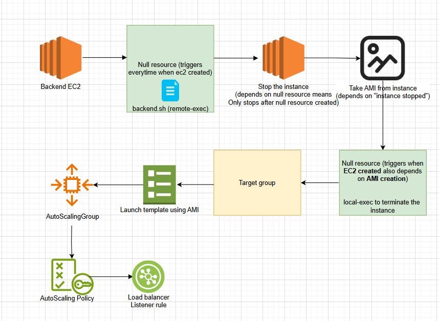

# Backend

### "triggers" Vs "depends on"

**✅ depends_on**

Use: To tell Terraform explicitly that a resource must be created only after another resource.

Why needed? Sometimes Terraform doesn’t automatically know the order of creation.

**✅ triggers (used inside null_resource)**

Use: To make a null_resource run again when something changes, like a file or variable.

Why needed? null_resource doesn’t automatically know when to re-run, so we manually define what triggers it.

